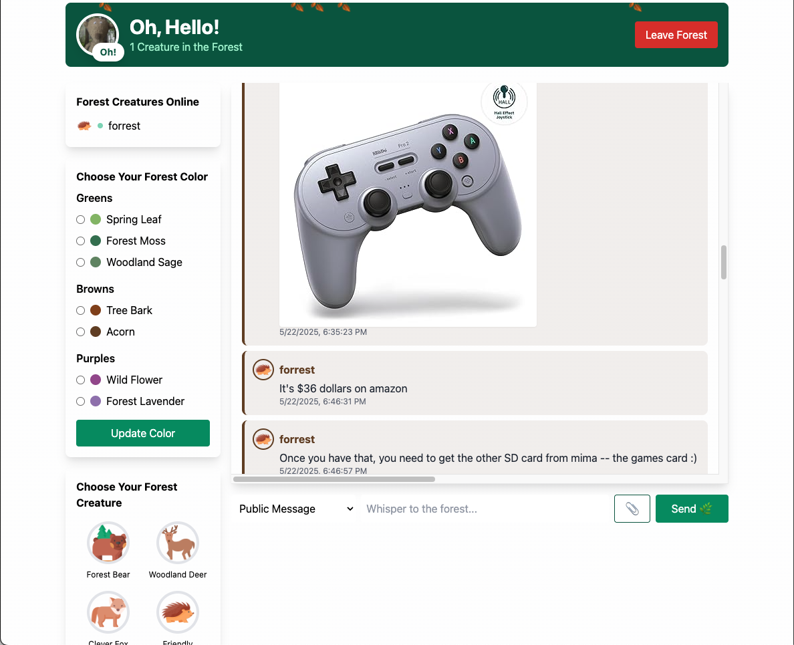

# Oh, Hello! - Forest Friends Chat

A real-time chat application with a forest theme where users can interact as woodland creatures. Built with Flask and Socket.IO for seamless real-time communication on private servers and home computing systems. Built with saftey in mind for all ages.

## Features

- Real-time messaging with WebSocket support
- Private and public messaging
- Customizable forest-themed color schemes
- Multiple forest creature avatars (Bear, Deer, Fox, Hedgehog, Owl)
- File attachments (images, videos, documents)
- Session management with auto-cleanup
- User authentication and registration
- Responsive design with Tailwind CSS
- Message history
- Online user tracking

## Tech Stack

- **Backend**: Flask, Flask-SocketIO, Flask-SQLAlchemy
- **Database**: SQLite
- **Frontend**: HTML, JavaScript, Socket.IO Client
- **Styling**: Tailwind CSS
- **Authentication**: Werkzeug Security
- **File Handling**: Secure file uploads with validation
- **Scheduling**: APScheduler for session cleanup

## Installation

1. Clone the repository:
```bash
git clone https://github.com/Bear-Bait/oh-hello.git
cd oh-hello
```

2. Install dependencies:
```bash
pip install flask flask-socketio flask-sqlalchemy werkzeug apscheduler
```

3. Run the application:
```bash
python forest-friends-chat.py
```

4. Open your browser and navigate to `http://localhost:5000`

## Usage

### First Time Setup
- Register a new account at the login page
- Choose your forest color and creature avatar
- Start chatting with other forest friends

### Sending Messages
- Public messages are visible to all connected users
- Private messages can be sent by selecting a recipient from the dropdown
- Attach files by clicking the attachment button

### Customization
Choose from various forest-themed colors:
- Greens: Spring Leaf, Forest Moss, Woodland Sage
- Browns: Tree Bark, Acorn
- Purples: Wild Flower, Forest Lavender

Select your forest creature avatar:
- Forest Bear
- Woodland Deer
- Clever Fox
- Friendly Hedgehog
- Wise Owl

## File Structure

```
oh-hello/
├── forest-friends-chat.py    # Main application with enhanced features
├── web_chat.py               # Simplified web chat version
├── kids-email.py             # Email functionality module
├── media/                    # Media assets
│   ├── forest_creatures/     # Avatar images
│   └── attachments/          # User uploaded files
├── migrations/               # Database migrations
├── versions/                 # Version history
├── client/                   # Client-side assets
└── testing/                  # Test files
```

## Configuration

Key configurations in `forest-friends-chat.py`:
- `MAX_CONTENT_LENGTH`: 25MB file size limit
- `ALLOWED_EXTENSIONS`: Supported file types
- Session cleanup: Runs hourly, removes sessions older than 24 hours
- Default test user: username `test`, password `test`

## Security Features

- Password hashing with Werkzeug
- Session management with automatic cleanup
- Secure filename handling for uploads
- File type validation
- SQL injection protection via SQLAlchemy ORM
- MIME type verification

## License

This project is open source and available for educational purposes.

## Contributing

Feel free to submit issues, fork the repository, and create pull requests for any improvements.

## Credits

Developed with care for creating a friendly, forest-themed communication space.
